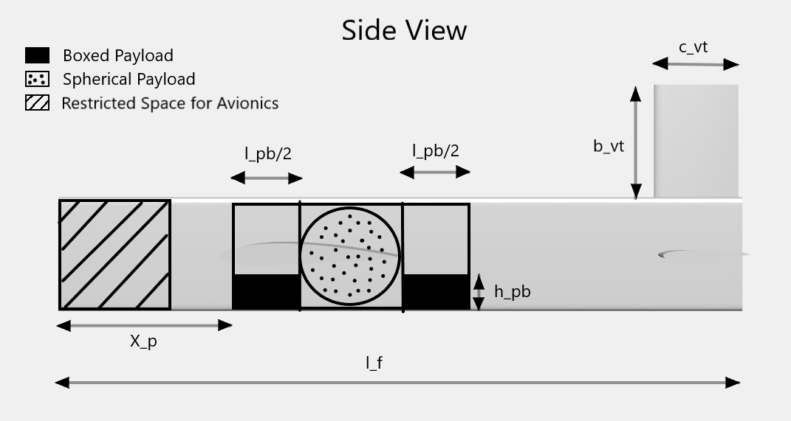
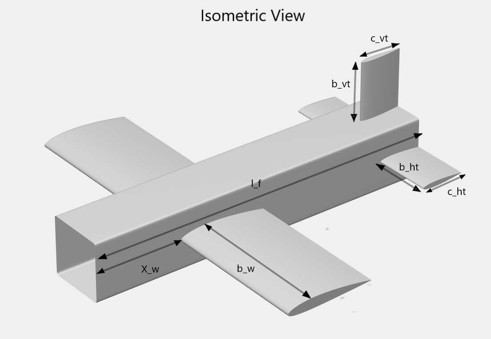
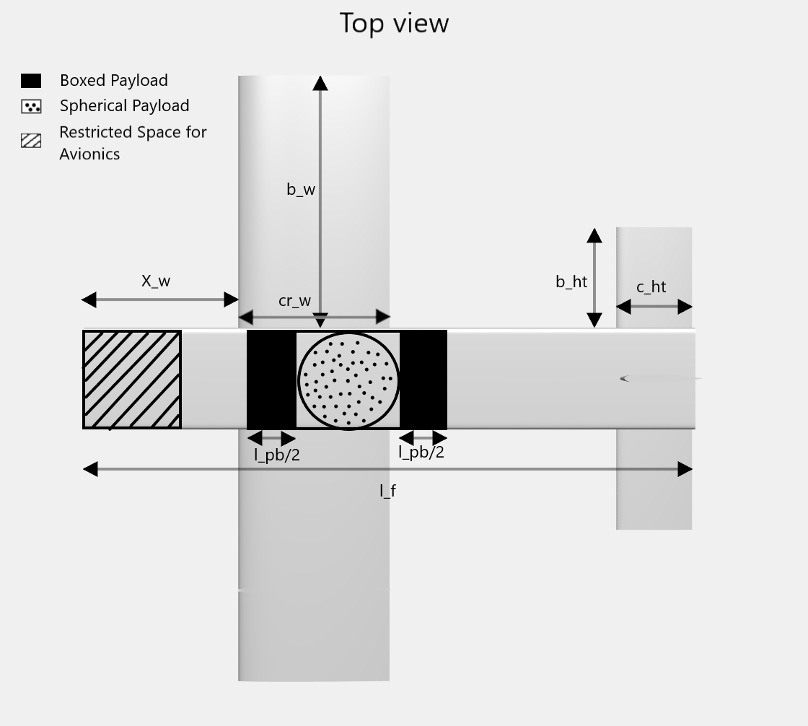

# Model Aircraft Design Optimization

Copyright 2022 The MathWorks&reg; Inc.

## Introduction

This demo optimizes an aircraft with SAE Aero Design 2020 Regular Class problem statement as an example. A problem based approach is used to construct the design optimization problem. For SAE Aero Design 2020 Regular Class competition, each team's objective was to maximise their Final Flight Score ($`FFS`$) which was the sum of three highest Flight Scores ($`FS_i`$) and a Payload Prediction Bonus ($`PPB`$).

$`FFS = FS_1 + FS_2 + FS_3 + PPB`$

Each individual Flight Score ($`FS`$) was calculated as follows

$`FS = 120\times\frac{2\times N_s + W_{BP}}{b_w + l_{cargo}}`$

where,

$`N_s =`$ No.  of  Spherical  Payload

$`W_{BP} =`$ Weight of Boxed Payload (lbs)

$`b_w =`$ Wingspan (in)

$`l_{cargo} =`$ Length of Payload Bay (in)

Therefore, this demo maximizes the following objective as it performs calculations in SI Units. Also,  as only 1 spherical payload is considered.

$`Objective = 120\times \frac{2 + 2.2\times W_{BP}}{39.37\times(b_w + l_{cargo})}`$

 A problem based approach is used to construct the design optimization problem. All expressions evaluated during problem setup are stored as a hierarchy of structure inside the aircraft structure. Four domain specific functions incrementally construct the design problem by modelling domain specific expressions and adding any relevant constraints. Finally, a 12 dimensional optimization problem is obtained with the following optimization variables.
| Symbolic Variable  | Physical Quantity  | 
| -------------------- |:-------------:|
| $`b_w`$ | Wing Half Span |
|$`cr_w`$| Wing Root Chord|
| $`lambda_w`$| Wing Taper Ratio|
| $`X_w`$| Wing X Location|
| $`b_{ht}`$| Horizontal Tail Half Span|
| $`c_{ht}`$| Horizontal Tail Chord|
| $`b_{vt}`$| Vertical Tail Half Span|
| $`c_{vt}`$| Vertical Tail Chord|
| $`l_f`$| Length of Fuselage|
| $`l_{pb}`$| Length of Boxed Payload|
| $`h_{pb}`$| Height of Boxed Payload|
| $`X_p`$| Cargo Bay X Location|
        
Following is the representation of optimization variables.

<table>
<tr>
<td>  </td>
<td>  </td>
</tr>
<tr>
<td>  </td>
<\tr>
</table>

## Code Structure
 **optimizeAircraft.mlx** sets up and solves an aircraft design optimization problem.
All other live functions model domain specific expressions and constraints and help incrementally setup the optimization problem.

## Setup
1. Clone the repository.
2. Open MATLAB&reg; and navigate to the repository.
3. Open and **execute** the live script optimizeAircraft.mlx

### MathWorks Products

Requires MATLAB release R2022a or newer

- [Aerospace Blockset&trade;](https://www.mathworks.com/products/aerospace-blockset.html)
- [Global Optimization Toolbox](https://www.mathworks.com/products/global-optimization.html)

## License

The license for Model Aircraft Design Optimization is available in the [LICENSE.TXT](LICENSE.TXT) file in this GitHub repository.

For any queries, contact the authors at roboticsarena@mathworks.com
